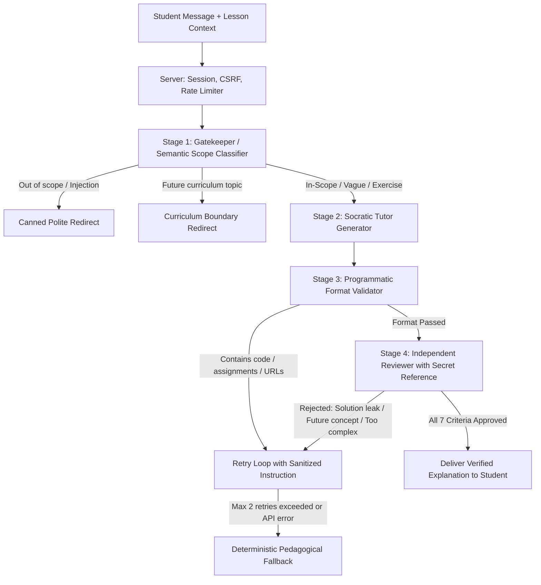

# Socratic Curriculum Tutor: Multi-Stage Pedagogical AI Agent for Hardware & C++ Education

[](#running-tests)
[](https://nodejs.org)
[](https://opensource.org/licenses/MIT)

> An autonomous, curriculum-grounded AI tutoring engine designed for middle-school students (grades 7–8) learning C++ and physical computing on the ESP32. Production-proven on [Vibe Boards](https://vibe-boards.mooo.com/).

---

## 🎯 The Pedagogical Problem: Why Generic LLMs Fail in Education

When standard AI chatbots (ChatGPT, Claude, etc.) are embedded into educational platforms, they frequently break the learning process:
1. **Instant Solution Spoilers**: A student asks *"My code won't compile"* or *"How do I blink two LEDs?"*, and an off-the-shelf LLM immediately writes the complete source code or provides direct patches. The cognitive effort required to learn is bypassed entirely.
2. **Curriculum Bleed & Premature Concepts**: When a beginner at Lesson 3 (Digital Outputs) gets stuck, a raw model often recommends advanced C++ constructs (pointers, FreeRTOS tasks, hardware timer interrupts, C++ classes, `static` variables), confusing the learner and derailing the syllabus.
3. **Multi-Turn Solution Extraction**: Even if a bot is instructed *"Don't give the answer"*, clever students bypass this in 2–3 turns by asking for the next line of code, extracting the answer piece-by-piece.
4. **Vague Frustration Loops**: When a struggling 13-year-old simply types *"it doesn't work"* or *"I'm stuck"*, naïve bots reply with counter-questions like *"What have you already tried?"*, which causes frustration rather than pedagogical scaffolding.

**Socratic Curriculum Tutor** is an engineered, multi-agent pipeline designed specifically to solve these challenges.

---

## 🧠 Key Principles

- **Zero Ready-Made Solutions**: Never outputs complete sketches, code patches, ready-made variable declarations, numerical answers, or line-by-line algorithmic solutions.
- **Socratic Guidance & Scaffolding**: Explains core concepts, offers intuitive real-world analogies, and isolates a single, actionable observation or small next step for the student.
- **Curriculum-Grounded Knowledge Boundary**: The agent has **no awareness of future lessons**. It strictly operates within the current lesson's theory and explicitly declared prerequisites.
- **Deterministic Multi-Stage Verification**: Every user interaction passes through three distinct model phases and programmatic format gates before any token reaches the student.
- **Independent Adversarial Review**: A draft explanation is scrutinized by a separate reviewer model that holds the secret reference solutions and verifies multi-turn conversation safety.

---

## 🏗️ Architecture & Pipeline Flow

The engine uses a 4-layer inspection pipeline for every query:



### Detailed Breakdown of the Verification Stages

#### 1. Stage 1: Gatekeeper / Semantic Scope Classifier (`gate`)
- Evaluates student intent against the lesson's target concepts (`focus`), excluded topics (`excluded`), and prerequisite list (`prerequisites`).
- Classifies into:
  - `in`: Relevant theoretical question, error analysis, or struggle with a task.
  - `out`: Off-topic conversation, non-programming questions, or prompt injection / roleplay attempts.
  - `future`: Questions demanding concepts not yet taught in the syllabus (e.g., interrupts, FreeRTOS).
  - `clarify`: Pure gibberish or empty greetings. *(Note: short cries for help like "doesn't work" are deliberately kept as `in` so the tutor proactively assists with the most common obstacle instead of stalling).*
- Speculatively identifies which specific exercise the student is attempting without prompting the student to select one from a dropdown.

#### 2. Stage 2: Socratic Tutor Generator (`tutor / draft`)
- Provided **only** with the sanitized lesson theory, authorized prerequisite concepts, and exercise problem statements.
- **Strictly isolated from exercise reference solutions**: The generator never sees how the exercise is solved, making direct leakage impossible at generation time.
- Operates under strict prompt rules: 40–100 words, warm and approachable tone for 7th–8th graders, zero code blocks, and no direct answers.

#### 3. Stage 3: Programmatic Format Validator (`textAllowed`)
- Fast, deterministic regex/heuristic gate:
  - Strict length cap (<= 160 words, <= 2200 characters).
  - Blocks markdown code blocks (` ``` `, ` ~~~ `), HTML tags, links, and API key patterns.
  - Strictly blocks C++ variable declarations/assignments (`int x = ...`, `a += b`, etc.).
  - Allows at most one mention of a known function name (e.g., `digitalRead`), preventing code injection disguised as prose.

#### 4. Stage 4: Independent Adversarial Reviewer (`review`)
- A completely independent model invocation that acts as an educational supervisor.
- **Has access to the secret exercise references (`privateReferences`)** and the entire session history.
- Evaluates 7 strict boolean parameters:
  1. `scope`: Is it strictly within current lesson bounds?
  2. `level`: Is the complexity suitable for middle-schoolers?
  3. `correctness`: Is the technical and hardware explanation accurate?
  4. `noSolution`: Does the text leak the answer, decisive line of code, or algorithm?
  5. `cumulativeSafe`: When combined with prior messages in the chat history, does the student now possess the full answer piece-by-piece?
  6. `ageAppropriate`: Is the tone supportive without patronizing?
  7. `approve`: All criteria must evaluate to `true` with zero `reasonCodes`.

#### 5. Information-Isolated Feedback Loop
- If the reviewer rejects a draft, the system allows up to 2 revisions.
- **Critical Security Design**: The reviewer's raw text feedback is **never passed back to the tutor**. Passing raw feedback could inadvertently leak the hidden reference solution into the prompt. Instead, categorical codes (`solution`, `future_topic`, `too_complex`, etc.) are mapped by the server into sanitized, abstract instructions.

#### 6. Deterministic Fallback (`buildFallback`)
- If two consecutive drafts fail review, or if an external provider outage occurs, the system **never shows an unverified draft or a raw technical error**.
- It outputs a deterministic pedagogical fallback compiled directly from the lesson's title and primary focus concepts, guiding the student to their first small step.

---

## 🛡️ Curriculum-Bound Progression: How Past vs. Future Context Works

Traditional RAG systems inject broad search results across the entire documentation, which frequently exposes future knowledge. This engine uses a **curriculum dependency graph**:

```
[Lesson 01: Setup & IDE] 
       ↓
[Lesson 02: C++ Variables] 
       ↓
[Lesson 03: LED Basics (GPIO Output)]
       ↓
[Lesson 04: Button Basics (GPIO Input & Pull-up)]
```

### 1. Explicit Scope Policies (`server/policy.json`)
Every lesson in the curriculum is governed by a declarative contract:
```json
{
  "button-basics": {
    "concepts": "button, digital input, INPUT, INPUT_PULLUP, pull-up resistor, floating pin, digitalRead, LOW/HIGH, if/else, debounce basics",
    "prior": [
      "cpp-variables",
      "led-basics"
    ],
    "exclude": "hardware interrupts, C++ classes, pointers, FreeRTOS tasks"
  }
}
```

### 2. Context Compiler (`server/build-context.mjs`)
- At build time, raw lesson HTML and markdown are ingested.
- **Reference Stripping**: Exercise answers, solutions, and spoiler sections are stripped from public theory packets into protected teacher packets.
- **Prerequisite Chaining**: For any given lesson, the agent is granted access **only** to the concepts of its declared `prior` dependencies. It possesses zero context of upcoming topics.
- When a student at `button-basics` asks: *"Can I use an interrupt or attachInterrupt to make this faster?"*, the Gatekeeper flags this as `future` and responds:
  > *"This topic goes beyond the fundamentals of our current lesson. Let's first make sure the basic concepts here are clear. Which part of the current circuit is puzzling you?"*

---

## 🔒 Security & Privacy by Design

- **Stateless Anonymous Sessions**: No student tracking or persistent accounts. Conversations reside in RAM with a 1-hour expiration.
- **No Private Keys in Client or Logs**: Browser clients communicate exclusively with the local origin (`/api/tutor/chat`). No credentials, system prompts, or draft logs ever reach the browser or disk logs.
- **CSRF & Rate Limiting**: SameSite strict cookies, session-bound CSRF tokens, strict origin verification, and rolling window rate limits (12 queries / 5 min).
- **Daily Quota Hardcap**: Global server-side request cap to prevent runaway API costs or DDoS exploitation.

---

## 📁 Repository Structure

```
vibe-boards-ai-tutor/
├── .gitignore               # Strict ignore for credentials, tokens, logs
├── LICENSE                  # MIT License
├── package.json             # Pure Node.js scripts (zero production dependencies)
├── config.example.json      # Safe configuration template (NO keys)
├── server/
│   ├── engine.mjs           # 4-stage pipeline (Gate -> Draft -> Format -> Review -> Fallback)
│   ├── prompts.mjs          # System prompts (SCOPE_RULES, GATE, TUTOR, REVIEW)
│   ├── provider.mjs         # Resilient LLM HTTP client with retries and quotas
│   ├── jev-provider.mjs     # Optional TypeSafe Jev / OpenRouter decisions adapter
│   ├── server.mjs           # HTTP/REST server (sessions, CSRF, rate-limits)
│   ├── policy.json          # Lesson declarations: concepts, prior dependencies, exclusions
│   ├── build-context.mjs    # Curriculum compiler (HTML -> context packets)
│   └── curriculum.generated.json # Pre-compiled sanitized syllabus
├── client/
│   ├── LessonTutor.astro    # Production Astro component used on vibe-boards.mooo.com
│   └── demo.html            # Standalone browser demo UI
└── tests/
    ├── engine.test.mjs      # Pipeline, format gates, anti-jailbreak, cumulative leakage tests
    ├── server.test.mjs      # Session security, CSRF, origin check, traversal tests
    └── jev-provider.test.mjs # TypeSafe decision adapter tests
```

---

## 🚀 Getting Started

### Prerequisites
- Node.js 20+ or 22+ (no runtime npm dependencies required!)
- An API key for an OpenAI-compatible Chat Completions provider (CommandCode, DeepSeek, OpenRouter, etc.)

### Installation
```bash
git clone https://github.com/myratmyradov1997/vibe-boards-ai-tutor.git
cd vibe-boards-ai-tutor
```

### Configuration
Create a private credentials file outside the repository (or set `TUTOR_CONFIG_FILE`):
```bash
mkdir -p ~/.config/vibe-boards-tutor
cp config.example.json ~/.config/vibe-boards-tutor/credentials.json
chmod 600 ~/.config/vibe-boards-tutor/credentials.json
```

Edit `~/.config/vibe-boards-tutor/credentials.json`:
```json
{
  "endpoint": "https://api.your-provider.com/v1/chat/completions",
  "apiKey": "YOUR_SECRET_API_KEY",
  "tutorModel": "deepseek/deepseek-v4.1-flash",
  "reviewerModel": "deepseek/deepseek-v4.1-flash"
}
```

### Running Tests
The test suite runs against the built-in Node.js test runner:
```bash
npm test
```
Outputs:
```text
✔ approved draft only; private answers not sent to tutor
✔ unrelated and future topics never reach tutor
✔ reviewer unavailable blocks draft
✔ malformed approval and all criteria fail closed
✔ rejected draft reaches repair as data, without private reviewer feedback
✔ cumulative leakage rejected after one repair without a third draft
✔ format rejection has only one bounded repair and never reaches review
✔ vague message still gets a real answer instead of a canned prompt
✔ fallback names the lesson concepts instead of asking what was tried
...
ℹ pass 31
ℹ fail 0
```

### Starting the Server
```bash
npm start
```
The server will bind to `http://127.0.0.1:4340`.

---

## 📄 License
MIT License. Created by [Myrat Myradov](https://github.com/myratmyradov1997) for [Vibe Boards](https://vibe-boards.mooo.com/).
